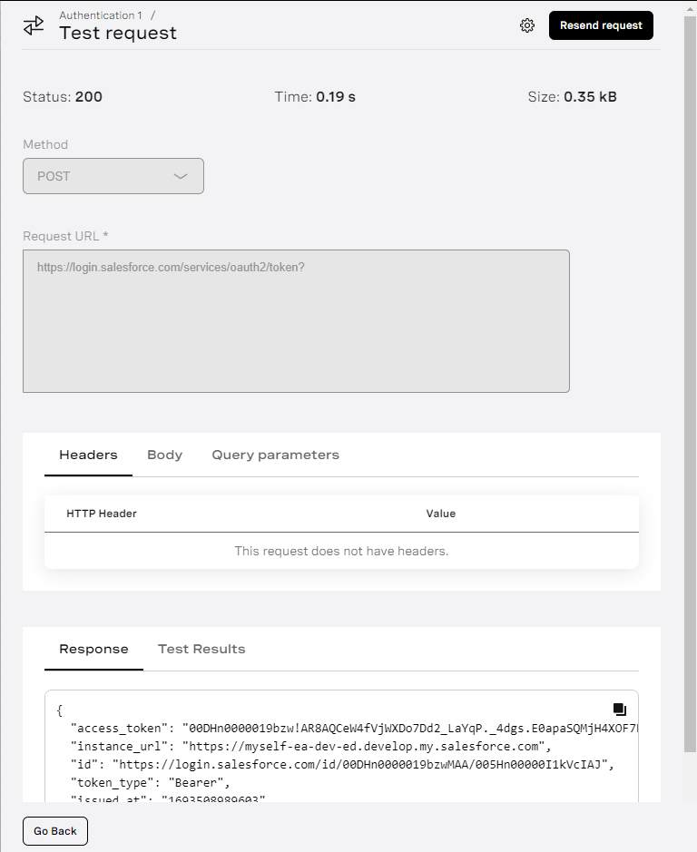
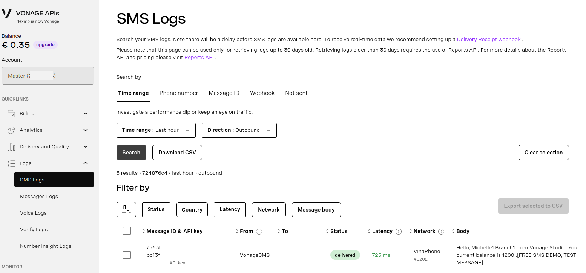

## Vonage and Salesforce Mini-Hack Tutorial


This demo application shows you how to integrate [Vonage's AI Studio](https://www.vonage.com/communications-apis/ai-studio/) and Salesforce to build and deploy an AI-powered conversational application that integrates with your existing Salesforce data. 

For complete API documentation, refer to [developer.vonage.com](https://developer.vonage.com/en/documentation).

## Prerequisites

To follow along, ensure that you have a: 
 
1. [Salesforce Developer account](https://developer.salesforce.com/signup) that belongs to an organization created in Salesforce. You will use this account to create an app in your Salesforce organization, so you can integrate Salesforce and Vonage AI Studio.

2. [Vonage Developer account](https://ui.idp.vonage.com/ui/auth/registration) for using Vonage AI Studio.

Once you have created an account, click on **API Dashboard** at the [top of the page](https://dashboard.nexmo.com/). Next, under **Quick Links** on the left hand side, click **Billing** > **Coupons**. Enter the coupon code found on the Mini-Hack site for €5 of free credit. You'll also need to add your address and once all is complete hit the **Submit** button.

Scroll down the page and you'll see **Build and Manage**, then select **API Settings**. Look for **SMS Settings** on the right hand side and ensure that the **Messages API** is selected. Scroll to the bottom to **Save** your changes. 

## Introduction
Customer satisfaction is vital to the success of your company. When customers love your product, they'll naturally spread the word to friends and family. As a result, your company will bring in new users who often prove to be more loyal than those acquired through marketing campaigns.

Boosting customer satisfaction often involves consistent engagement. For example, reaching out when they sign up for a new account in your system or buy a new product. While creating an application for this purpose from scratch is both time-consuming and expensive, there's a more efficient solution: using an artificial intelligence (AI) tool like Vonage AI Studio to quickly implement the application for engaging with your customers. 
 
With Vonage AI Studio, you can customize your customer journey flow to meet your exact use case just by clicking and dragging items. In this article, let’s learn how to integrate Salesforce into Vonage AI Studio so that you can take advantage of the existing user data you already have in Salesforce to improve customer engagement.

## What is Vonage AI Studio?

Vonage AI Studio is a user-friendly, low-code platform designed for people with little or no experience with programming to create customer-engaging solutions. At the heart of Vonage AI Studio is a digital AI assistant that communicate in natural language. This means your customers can converse without needing to follow any specific question format, using certain keywords, or via a set of options.
 
Vonage AI Studio allows you to interact with your users via text and voice via any channel, such as SMS, email, or WhatsApp. You can also integrate Vonage AI Studio with other tools, such as Salesforce, to leverage existing customer data you already have and start implementing the customer-engaging solution right away. 

## The Demo User Flow

Let’s say you want to automatically send a message showing the customer's current account balance when they text a message to the AI Studio App. 
 
The solution for implementing the user flow will be like below: 

- When a customer texts a message to a Vonage AI Studio App, the app will store the customer’s phone number in a variable.
- Then the AI Studio App will look for the customer’s first name, last name, and account balance by querying data from the Salesforce database based on the customer’s phone number.
- Finally, the AI Studio App will send a greeting SMS with "Hello, `$USER.FIRSTNAME` `$USER.LASTNAME` from Vonage AI Studio. Your current balance is `$USER.ACCOUNTBALANCE`." content to the customer.
 
To build the demo application, you need to execute three steps: 

- Step 1: Create a Salesforce application in the Salesforce Platform 
- Step 2: Add data to the Salesforce app 
- Step 3: Create the flow in Vonage AI Studio 

## Step 1. Create a Salesforce application in the Salesforce Platform

First, using the Salesforce Developer account, log in to your Salesforce domain as an administrator. Currently, there are two user interfaces(UIs) when using Salesforce: “Salesforce Lightning Experience” and “Salesforce Classic”. The design between these two styles is slightly different.

For this tutorial, we'll use the Lightning Experience UI.  
 
From the Salesforce Homepage, click on the gear icon on the top right of the screen, then choose **Setup**.


Locate the **Quick Find** search option at the top-left of your screen. Type **oauth** and select **OAuth and OpenID Connect Settings**. 

To enable the username-password flow, select **Allow OAuth Username-Password Flows** and turn it to the **On** state, as shown below.


Clear the search field and scroll down to **Platform Tools**, click on **Apps**, then choose **App Manager**. 


You should now see the **Lightning Experience App Manager** as shown below. Click on **New Connected App** to create a new Salesforce app. 


There are several fields that you'll need to enter data for. 

* **Connected App Name** - Enter **Vonage AI Studio** as the name.
* **API Name** - Should be automatically generated as "Vonage_AI_Studio". You shouldn't need to do anything here.
* **Contact Email** - Enter your chosen contact email address, such as the email address of your Salesforce administrator.

Under **API (Enable OAuth Settings)**, check the box next to **Enable OAuth Settings**. When you do this, more fields and options will appear.

* **Callback URL** - Use "http://localhost/" without the quotes.

From the **Selected OAuth Scopes** > **Available OAuth Scopes**, select:

* Full access(full)
* Manage user data via APIs (api)
* Perform request at any time (refresh_token, offline_access) 

Add these to your **Selected OAuth Scopes** by clicking the **Add Button**.

Your screen should be like the one below. Once complete, scroll to the bottom and press **Save** and then **Continue**. 


Scroll down to **API (Enable OAuth Settings)** and, next to **Consumer Key and Secret**, click on **Manage Consumer Details**. You'll be asked to **Verify your identity** for security reasons. 

Save a copy of the **Consumer Key** and **Consumer Secret** found on this page to use later in **Step 3** for authenticating to Salesforce. 


On the lefthand bar under **Administer**, click **Manage Apps** and choose **Connected Apps**. Select the Master Label you are working with then click **Edit Policies**. 

Under OAuth Policies, change **IP Relaxation** to **Relax IP Restrictions** and press **Save** to continue. 


**Note**: If, at any point, you do not see your app on the Lightning Experience App Manager after creating it, try refreshing the page.

## Step 2. Add data to the Salesforce

Now that you have successfully created the Salesforce-connected app let’s add some user contacts to the Salesforce platform so you can use it in the Vonage AI Studio App. 

There are multiple ways to add data to Salesforce. For this mini-hack, we'll focus on **Manually adding a contact**.

### Manually Add Contacts

Click on **Home** in the top left-hand corner of your screen. 


From the Salesforce home page, click on the **Search box** at the top to search for **All Contacts** and click on the **All Contacts** option to activate it.


On the **All Contacts** page, click the **New** button to add a new contact.


Below is what the **New Contact** form looks like. 


Fill in the information as shown below. 

- Salutation: Mrs.
- First Name: Michelle
- Last Name: Branch
- Phone: your phone number (You should put your cell phone number here to test whether you can retrieve the user account balance from Salesforce using Vonage AI Studio.)
- Email: michellbrach1@gmail.com

The New Contact form should look like below once you have your sample data included:


Click on the **Save** button to save the contact. Then click on the **New Note** button. 


On the **New Note** dialog: 

* **Title** - set this to **AccountBalance**
* **Body** - set this to 1200

Press the **Save** button to continue. 


You have manually added a contact to Salesforce with an account balance that we'll retrieve using AI Studio in the next step. 

## Step 3. Create the flow in Vonage AI Studio

Let’s create the flow in [Vonage AI Studio](https://studio.ai.vonage.com/agents) to send greeting messages automatically to users. Remember that you first need to [sign up](https://ui.idp.vonage.com/ui/auth/registration) for a Vonage account.

To begin, navigate to [Vonage AI Studio](https://studio.ai.vonage.com/agents) and press the **Create Agent** button. 

* Agent Type: SMS
* Region: Leave "United States" as the default.
* Agent Name: Use "VonageSample" without quotes.
* Language: Select the language that you want to use.
* Time Zone: Select UTC and press the next button to continue. 

Your screen should look like this so far: 


On the next screen, for **Choose Template**, select **Start From Scratch** and press the next button to continue. 

For the **Select Event** option, choose **Inbound Session** and press **Create** to continue.

### Exploring the main user interface

Next, you will see the main user interface of AI Studio! If you’d like a primer on what it is capable of, visit [here](https://studio.docs.ai.vonage.com/ai-studio/create-a-new-agent).

To keep things simple, we’ll create the following conversation flow by dragging and dropping nodes onto the canvas:


You have four nodes: 

* "START" - Placed automatically on the canvas for you.
* "Salesforce Authentication" - Can be found under **Nodes** -> **Integrations**
* "Salesforce Actions" - Can be found under **Nodes** -> **Integrations**
* "Send SMS" - Can be found under **Nodes** -> **Actions**

If you are having a hard time finding **Send SMS**, then see the screenshot below: 


As shown above, drag and drop the nodes onto the canvas and connect them together. 

Let's now set some of the **Parameters** that we'll use later in the tutorial. **Parameters** will store pieces of information that our application uses later. 

### Setting Parameters

From the canvas interface, look under **Properties**, and you'll see an entry called **Parameters**. 

Click on this and create a **Custom Parameter** called **SALESFORCE_TOKEN** with entity type **@sys.any**.


Inside the **User Parameters** category, press the **Add user parameter** button to create three parameters with the following names: 

* **FIRSTNAME**
* **LASTNAME**
* **ACCOUNTBALANCE**


Press **Close** when finished.

## Configuring the Different Node Types 

### The "START" node

The “START” node is the entry point of the flow and must connect with another node in the flow to initialize it. We don't need to make any changes here. 


### The "Salesforce Authentication" node 

The **Salesforce Authentication** node is used for authenticating to the Salesforce application using Salesforce credentials. 


On your canvas, Look for **Authentication 1** and press **Click here to edit**. 

In the **Salesforce Authentication** node, you need to provide the five values below: 

- **Client ID** (Salesforce refers to this as the Client Key): The client ID of the Salesforce connected app, which you saved earlier in Step 1.
- **Client secret**: The client secret of the Salesforce-connected app 
- **User name**: Your Salesforce admin user name 
- **Password**: Your Salesforce admin password 
- **Parameter**: Select "SALESFORCE_TOKEN" as the parameter value from the drop-down list.

**Note**: In this case, the parameter holds the Salesforce token from the authentication API response. You'll use this parameter to retrieve user data from Salesforce.

To test the **Salesforce Authentication** node, click **Test request** on the top right of the Salesforce Authentication node. You should see a 200 successful status code with the Salesforce access token in the response body of the test request. 



**Note**: You should put your Salesforce username into the "User name" field, not the email. Your Salesforce username could be different from your email instead.

### The “Salesforce Actions” node

The **Salesforce Actions** node gets the Contact information from the Salesforce database using the user’s phone number. Look for **Actions 1** on the canvas, and press **Click here to edit**. 


You need to provide the three following inputs for the “Salesforce Action” node: 
- The "Tenant domain": the domain name of your Salesforce platform. This can be found by clicking on your user profile and copying the URL below.


- The **Token parameter** is the parameter for which you saved the Salesforce token. Choose the "SALESFORCE_TOKEN" option as the parameter value. 
- The **Actions** is the Salesforce query, which you use to get the user’s first and last names using their phone numbers.  

Choose the **Actions** query as **Get record** and copy the following content to the textbox: 

```sql
select
  FirstName,
  LastName,
  (
	SELECT
  	Note.Body
	FROM
  	Contact.Notes
  )
from
  Contact
where
  Phone = '$SENDER_PHONE_NUMBER'

```

The `$SENDER_PHONE_NUMBER` is a built-in system parameter that Vonage AI Studio has created. Vonage AI Studio can capture the user's phone number automatically for you and save it in this system parameter. To learn more about the Salesforce query, visit the [Salesforce Object Query Language documentation](https://developer.salesforce.com/docs/atlas.en-us.soql_sosl.meta/soql_sosl/sforce_api_calls_soql.htm) page. 

In the **Response Mapping** section, you must set the record results to map the `FirstName,` `LastName,` and `Notes` created earlier. 

Ensure yours looks like the following, and then press **Save & Exit** to continue. 

* records[0].FirstName - Select **USER.FIRSTNAME** from the drop down
* records[0].LastName - Select **USER.LASTNAME** from the drop down
* records[0].Notes.records[0].Body - Select **USER.ACCOUNTBALANCE** from the drop down


### The “Send SMS” node

The **Send SMS** node sends an SMS message to whoever calls the number. You'll need to configure three settings: 

- **From:** field = $AGENT_PHONE_NUMBER
- **To:** field = $SENDER_PHONE_NUMBER
**Note**: Type '$' then click on **SENDER_PHONE_NUMBER**.
- **Body:** field = Copy and paste the following text without quotation marks

    "Hello, `$USER.FIRSTNAME` `$USER.LASTNAME` from Vonage AI Studio. Your current balance is `$USER.ACCOUNTBALANCE`." 

- The **Send SMS** node will replace the `$USER.FIRSTNAME`, `$USER.LASTNAME`, and `$USER.ACCOUNTBALANCE` variables with the actual values of your user, which have been saved to the `FIRSTNAME`, `LASTNAME`, `ACCOUNTBALANCE` user parameters. 


## Test the AI Studio App

To test the created AI Studio App, click on the **Tester** button at the top right of the flow screen page to simulate a user sending a message to the AI Studio App.  
 
Press the **Gears** icon and set the following: 

* **AGENT_PHONE_NUMBER** to the Vonage phone number assigned to this app. (You can click on Publish to find it if you don't remember it)
* **SENDER_PHONE_NUMBER** to the cell phone number you registered the Contact with. (This should be your cell phone number.)


Click on the **Start Chat** button to test the app. You should see all the nodes are executed successfully, and SMS is sent to the user with content as below: 
 
"Hello, Michelle Branch from Vonage AI Studio. Your current balance is 1200." 

Congrats, you're done! 

## Optional - Publish the app

If you want to test this on your phone, press the **Publish** button at your screen's top right-hand corner. You'll see **Assign a phone number to publish**. 


Select the phone number assigned to your account and press **Assign Number**. 

You can leave the next screen titled, **Details**, as-is and press the **Publish** button to complete this part. Now, if you dial the number assigned to your cell phone, you should get an SMS message with the details in the **Tester** app. 
 
## Troubleshooting

Go to the SMS Logs page in the Vonage Developer Portal to troubleshoot, then click on **Message Logs**.



In the listed messages, you should see the detailed content of the recent message, which confirms that the SMS message has been sent successfully. 


## Conclusion 

This concludes the Voange and Salesforce Mini-Hack. Today, you learned how to integrate Salesforce into Vonage AI Studio to quickly implement your customer engagement flow without creating your own application. To learn more about other Vonage AI Studio use cases, check out the [Vonage blog](https://developer.vonage.com/en/blog/tags/ai-studio) page. 

Remember that we also have a Developer Cheat Sheet of our REST APIs that work with APEX. It fits nicely into your Trailblazer Field Guide; you already have one. Please let us know if not, and we'll supply you with one.

Vonage also has several activities at Dreamforce 2023, which can be found at 
[vonage.com/events](https://vonage.com/events/dreamforce). 

Finally, if you have questions or feedback, join us on the [Vonage Developer Slack](https://developer.vonage.com/community/slack) or send us a Post on [X](https://twitter.com/vonagedev), and we'll get back to you. Thanks again for reading, and we'll catch you on the next one!
